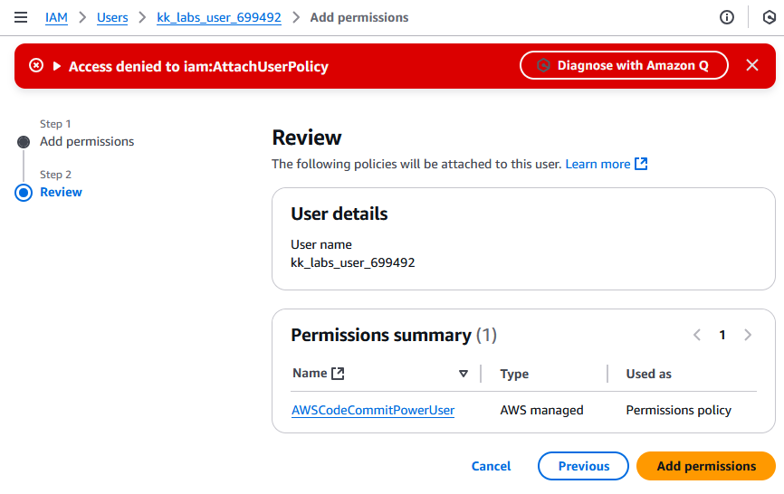
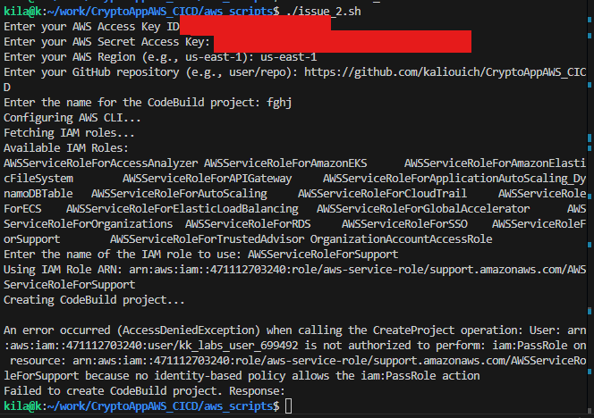

# Hi there! Welcome to my AWS CI/CD journey!

Happy coding!

## Week 2

# 🚀 Terraform Migration 🚀

I've successfully migrated my AWS infrastructure for the fake-crypto-webapp application from manual CLI commands to Terraform! This upgrade improves consistency, reliability, and reduces operational overhead. 🚀 The new infrastructure is highly automated and scalable.

🔧 My Terraform configuration orchestrates a seamless CI/CD pipeline:

- 📂 **CodeCommit Repository (fake-crypto-webapp):** The application's source code is version-controlled here.

- 🏗️ **CodeBuild Project (codebuild-fake-crypto-webapp):** Changes in CodeCommit trigger CodeBuild, which builds a Docker image and pushes it to...

- 📦 **ECR Repository (fake-crypto-webapp):** The built Docker image is stored securely in this registry.

- 🔄 **CodePipeline (crypto-app):** This pipeline orchestrates the entire deployment process, starting with CodeCommit and deploying to...

- ☁️ **ECS Cluster (khalil-lab-cluster):** The application's containers run within this managed cluster, leveraging an autoscaling group for dynamic scaling.

- ⚙️ **ECS Service (fake-crypto-webapp):** This service manages deployment and scaling of containers, incorporating a deployment circuit breaker for resilience.

- 🔗 **Application Load Balancer (khalil-lab-alb):** The load balancer distributes traffic across healthy ECS service instances, ensuring high availability. Security is managed by the khalil-lab-sg security group, and various IAM roles provide secure access.

## Week 1

# 🚀 AWS CI/CD Pipeline Setup 🚀

After diving deep into AWS services like ECR (Elastic Container Registry), CodeCommit, CodeBuild, and IAM roles, I’m excited to share my journey in developing a streamlined CI/CD pipeline! Below is a step-by-step outline of my process:

---

## 🔍 Workflow Overview

1. **AWS Access Creation:**  
   Generate an AWS Access ID and secret access key to utilize AWS CLI commands.

2. **Create ECR Repository:**  
   Set up an ECR repository for Docker images.

3. **Code Storage in CodeCommit:**  
   Use CodeCommit to store code from my GitHub repository.

4. **Build Process with CodeBuild:**  
   Integrate CodeBuild with the CodeCommit repository using a `buildspec.yml` file to define the build process.

5. **Build Execution:**  
   Initiate the build and ensure the Docker image is successfully pushed to ECR. I aim to minimize console use by leveraging the AWS CLI.

To put theory into practice, I utilized the **KodeKloud** playground and implemented all AWS CLI commands in a bash script. You can find the script in my GitHub repository: **[CryptoAppAWS_CICD](https://github.com/yourusername/CryptoAppAWS_CICD)**.

---

## ⚠️ Challenges Encountered

1. **CodeCommit Credentials Issue:**  
   Faced hurdles with AWS CodeCommit as the KodeKloud playground doesn’t allow the creation of Git credentials, complicating code transfer between GitHub and CodeCommit.

   🔗 Check my experimental script: [Issue 1 Script](https://github.com/kaliouich/CryptoAppAWS_CICD/blob/main/aws_scripts/issue_1.sh)  
   

2. **Policy Permissions Error:**  
   Encountered access denied errors due to insufficient IAM user permissions for AWS CodeCommit when using my SSH public key.

   🔗 Check my experimental script: [Issue 2 Script](https://github.com/kaliouich/CryptoAppAWS_CICD/blob/main/aws_scripts/issue_2.sh)  
   

3. **Build Project Creation Error:**  
   Received an `AccessDeniedException` while creating the CodeBuild project due to the lack of `iam:PassRole` permission for the required service role.

   🔗 Check my experimental script: `./aws_scripts/issue_2.sh`

---

## 🔧 Solution Implemented

To tackle these challenges, I adapted my strategy by manually creating the CodeBuild project. My script now retrieves the CodeBuild role and assigns the **AmazonEC2ContainerRegistryPowerUser** policy, enabling the `buildspec.yml` to successfully push the Docker image to ECR.

🔗 Check my AWS CICD script: `./aws_scripts/start.sh`  
📹 Watch the results: [Demo Video](https://www.youtube.com/watch?v=qFGDMNdryMw)

---

## 🌟 Conclusion

I am committed to overcoming obstacles to successfully implement a robust CI/CD pipeline using AWS services. Thank you for your support as I continue this exciting learning journey!

Feel free to connect or reach out if you have any questions or insights to share!

#AWS #CICD #DevOps #CloudComputing #LearningJourney
